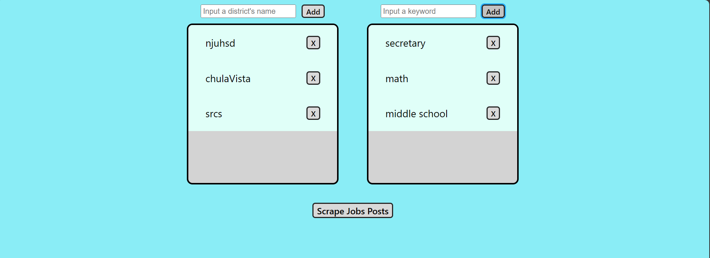

# Edjoin Job Posting Scraper

The purpose of this web application is to scrape links of job posts from certain school districts based on a list of keywords.

## How to run the Web Scraper locally

Have one terminal run under the directory of root project and type:

```
yarn dev
```

Have another terminal run under the backend directory and type:

```
node server.js
```

## How to use the Web Scraper

- Extract the subdirectory name of the district from the respective URL:


- Add this name to the list of district names

- Add keywords to the list scrape job titles that have the word
- Eg: 'Teacher', 'Technican', 'High School'

- Click 'Scrape Jobs Posts' to start scraping



- Give it sometime to return a list of links to matching job postings
  - Refresh your browser if it displays an error
  - You can download a text file with the links


